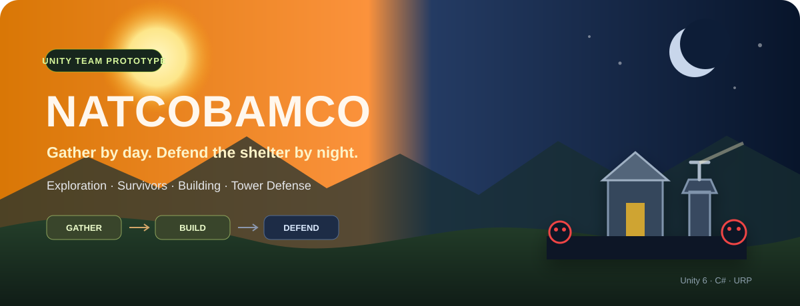
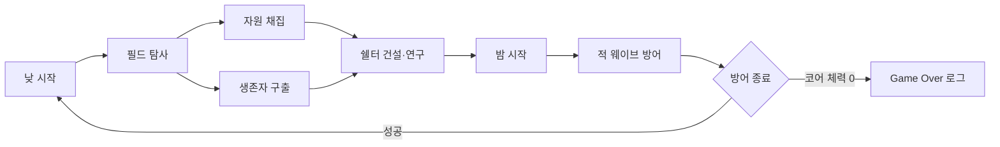

<div align="center">



# NatCoBamCo

**낮에는 자원과 생존자를 확보하고, 밤에는 건설한 방어 시설로 거점을 지키는 Unity 팀 프로토타입**

[](#프로젝트-상태)
[](#실행-방법)
[](#기술-스택)
[](#기술-스택)

</div>

---

## 프로젝트 소개

NatCoBamCo는 탐사·채집과 거점 방어를 낮과 밤의 흐름으로 연결한 Unity 팀 프로젝트입니다. 플레이어는 필드에서 나무·금속·식량을 모으고 생존자를 구출한 뒤, 쉘터에 벽과 타워를 배치해 적의 공격에 대비합니다.



## 프로젝트 상태

> **Status: Prototype / In Development**
>
> 주요 시스템을 팀원이 나눠 구현한 개발 중 프로토타입입니다. 저장소에는 여러 테스트 씬과 통합 전 단계의 기능이 함께 남아 있으며, 완성된 게임이나 배포 가능한 빌드로 소개하지 않습니다.

### 구현된 기반 기능

- 3인칭 이동, 달리기, 점프, 조준과 단발·연사·점사 사격
- 낮·채집·밤·방어 페이즈 상태 전환 구조
- 나무·금속·식량 자원 노드와 씬 간 인벤토리 유지
- 벽·일반 타워·전기 타워 배치, 회전, 미리보기, 철거
- 근접·원거리 적의 이동, 대상 선택, 건물 공격, 상태 효과
- 채집가·연구원·정비공 생존자 역할과 구출·배치 흐름
- 연구소, 거주구역, 의료시설, 필드·쉘터 간 포털의 기본 상호작용

### 부분 구현 또는 남은 작업

- 게임 페이즈 시간과 전환 조건에 테스트용 값·단축키가 남아 있음
- 건설·수리 시 자원 소모가 일부 로직에 연결되지 않음
- 거주구역의 생존자 강화·임무·채집 UI는 TODO 상태
- 정비공의 낮·밤 행동 전환이 전체 게임 흐름과 완전히 통합되지 않음
- 코어 체력이 0이 되면 현재는 Game Over 로그만 출력하며 별도 패배 화면·전환은 없음
- 연구 및 일부 UI 문자열·씬 연결은 추가 정리가 필요함
- 실행 파일과 GitHub Release는 제공하지 않음

## 핵심 시스템

| 시스템 | 현재 구현 내용 |
|---|---|
| 탐사·채집 | 자원 노드 상호작용, 자원 종류별 수량 저장, 씬 이동 |
| 생존자 | 구출 상태, 역할별 이동과 보너스, 씬 간 로스터 유지 |
| 건설 | 그리드 스냅, 설치 가능 영역 표시, 회전·철거 |
| 방어 | 코어·건물 체력, 적 타기팅, 공격 지점 예약, 웨이브 종료 |
| 타워 | 일반·저격·화염·전기 공격 코드와 투사체 |
| 연구·회복 | 연구 UI의 기본 흐름과 의료시설 상호작용 |

### 생존자 역할

| 역할 | 코드에 구현된 효과 |
|---|---|
| 정비공 `Mechanic` | 밤에 손상된 시설을 찾아 수리 |
| 채집가 `Gatherer` | 사용 가능한 상태일 때 자원 획득량 보너스 |
| 연구원 `Researcher` | 연구 시간 감소 보너스 |

## 기본 조작

아래 키는 현재 스크립트의 기본값이며 씬과 Inspector 설정에 따라 달라질 수 있습니다.

| 입력 | 동작 |
|---|---|
| `W A S D` | 이동 |
| 마우스 | 카메라 회전 |
| `Space` | 점프 |
| `Left Shift` | 달리기 |
| 마우스 왼쪽 | 사격 / 건설·철거 선택 |
| 마우스 오른쪽 | 정밀 조준 |
| `V` | 사격 모드 전환 |
| `E` | 채집·구출·시설·포털 상호작용 |
| `B` | 건설 모드 전환 |
| `X` | 철거 모드 전환 |
| `1` `2` `3` | 건설물 선택 |
| `R` | 건설 미리보기 회전 |

## 실행 방법

### 요구 환경

- Unity `6000.3.18f1`
- Universal Render Pipeline 17.3.0

```bash
git clone https://github.com/taehuni/NatCoBamCo.git
```

1. Unity Hub에서 저장소 루트를 프로젝트로 추가합니다.
2. 지정된 Unity 버전으로 프로젝트를 엽니다.
3. 패키지 임포트가 끝난 뒤 `Assets/00_Scenes/01_Main.unity`를 엽니다.
4. Play Mode에서 현재 연결된 기능을 확인합니다.

> 빌드 설정에는 통합 씬과 팀원별 테스트 씬이 함께 포함되어 있습니다. 전체 게임 흐름을 재현하려면 씬 오브젝트와 Inspector 참조 상태를 확인해야 합니다.

## 기술 스택


## 프로젝트 구조

```text
Assets/
├── 00_Scenes/              # 메인, 채집, 쉘터 및 기능별 테스트 씬
├── 01_Scripts/
│   ├── Enemy/              # 적 AI와 공격·상태 로직
│   ├── Player/             # 이동, 사격, 씬 영속성
│   ├── Survivor/           # 생존자 역할, 구출, 행동
│   └── Tower/              # 건설과 방어 시설
├── 02_Prefabs/
├── 03_Models/
├── 04_Animations/
└── 05_Materials/
```

## 개인 기여 — 민태훈

Git 커밋으로 확인되는 범위만 정리했습니다.

- 나무·금속·식량 자원 시스템과 채집 노드 연동
- 생존자 구출 상태와 채집가·연구원·정비공 역할 흐름
- 생존자와 자원 데이터의 씬 간 유지
- 필드·쉘터 테스트 씬과 포털 이동 구성
- 씬 재진입 시 생존자·자원 중복 및 UI 참조 문제 수정

적 AI, 건설, 타워, UI 등 다른 기능은 팀 전체가 나누어 구현했습니다.

## Contributors

- [tie1-os](https://github.com/tie1-os)
- [jimimini0812-ai](https://github.com/jimimini0812-ai)
- [TenderIsThePikachu](https://github.com/TenderIsThePikachu)
- [taehuni](https://github.com/taehuni)
- [pyoseol](https://github.com/pyoseol)

기여자 목록은 저장소의 공개 커밋 기록을 기준으로 작성했습니다.
